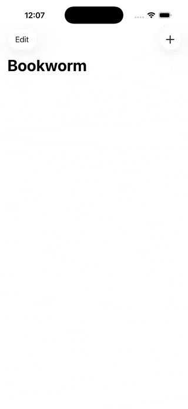

# 📚 Bookworm

Application iOS de suivi de lectures avec système de notation, avis et gestion de bibliothèque, développée avec **SwiftUI** et **SwiftData**.

`Swift` `iOS` `SwiftUI` `SwiftData`

## 📱 Aperçu

<div align="center">
  
</div>

## ✨ Fonctionnalités

- 📖 Ajout de livres avec titre, auteur, genre et avis
- ⭐ Système de notation 1-5 étoiles interactif
- 😊 Notation emoji dynamique selon la note
- 🔤 Tri multi-critères (titre, auteur)
- 🔴 Indicateur visuel pour les livres mal notés (rating 1 = rouge)
- 📅 Date d'ajout enregistrée automatiquement
- 🗑️ Suppression avec confirmation (alerte)
- ✏️ Mode édition avec EditButton
- 💾 Persistance automatique avec SwiftData
- ✅ Validation des champs (titre et auteur requis)

## 🛠️ Technologies utilisées

| Technologie | Utilisation |
|---|---|
| Swift | Langage de programmation |
| SwiftUI | Framework UI déclaratif |
| SwiftData | Persistance et modélisation des données |
| `@Query` | Requêtes automatiques avec tri |

## 🏗️ Architecture

```
Bookworm/
├── Book.swift              # @Model SwiftData (titre, auteur, genre, review, rating, date)
├── ContentView.swift       # Liste des livres avec @Query, tri, navigation
├── AddBookView.swift       # Formulaire d'ajout avec validation
├── BookDetailsView.swift   # Vue détail avec image genre, review, suppression
├── RatingView.swift        # Composant étoiles réutilisable (@Binding)
└── EmojiRatingView.swift   # Emoji dynamique selon la note
```

### Flux de données

```
┌─────────────────────────────────────────────────────┐
│  Book (@Model)                                      │
│  → title, author, genre, review, rating, date       │
│  → Persisté automatiquement par SwiftData           │
└─────────────────────────────────────────────────────┘
                        │
                        ▼
┌─────────────────────────────────────────────────────┐
│  ContentView                                        │
│  → @Query avec SortDescriptor multi-critères        │
│  → NavigationStack + .navigationDestination         │
│  → EditButton + onDelete                            │
└─────────────────────────────────────────────────────┘
              │                       │
              ▼                       ▼
┌──────────────────────┐  ┌───────────────────────────┐
│  AddBookView         │  │  BookDetailsView          │
│  → Formulaire + Form │  │  → Image genre            │
│  → Validation champs │  │  → Review + RatingView    │
│  → modelContext      │  │  → Suppression avec alert │
│    .insert()         │  │  → modelContext.delete()  │
└──────────────────────┘  └───────────────────────────┘
```

## 📚 Concepts SwiftUI appliqués

| Concept | Utilisation |
|---|---|
| `@Model` | Modèle de données SwiftData |
| `@Query` + `SortDescriptor` | Requête automatique avec tri multi-critères |
| `@Environment(\.modelContext)` | Insertion et suppression de données |
| `@Binding` | RatingView reçoit et modifie le rating du parent |
| `.constant()` | Binding en lecture seule dans BookDetailsView |
| `.navigationDestination(for:)` | Navigation type-safe vers BookDetailsView |
| `.sheet` | Modal pour AddBookView |
| `.alert` | Confirmation avant suppression |
| `EditButton` | Mode édition natif pour la liste |
| `.scrollBounceBehavior` | Désactive le scroll inutile |
| `ModelConfiguration(isStoredInMemoryOnly:)` | Container in-memory pour les Previews |

## ⭐ Composant RatingView

Composant réutilisable avec étoiles interactives :

- Configurable : label, nombre max d'étoiles, images on/off, couleurs
- Utilise `@Binding` pour la communication bidirectionnelle
- `.buttonStyle(.plain)` pour un tap précis dans les listes

## 🚀 Installation

```bash
git clone https://github.com/guitch95/Bookworm.git
cd Bookworm
open Bookworm.xcodeproj
```

## 📈 Améliorations possibles

- [ ] Recherche par titre ou auteur
- [ ] Filtrage par genre
- [ ] Tri dynamique (comme iExpense)
- [ ] Statistiques de lecture (Charts)
- [ ] Import/export de la bibliothèque

## 👤 Auteur

**Guillaume Richard**

## 📚 Ressources

- [100 Days of SwiftUI - Project 11](https://www.hackingwithswift.com/books/ios-swiftui/bookworm-introduction)
